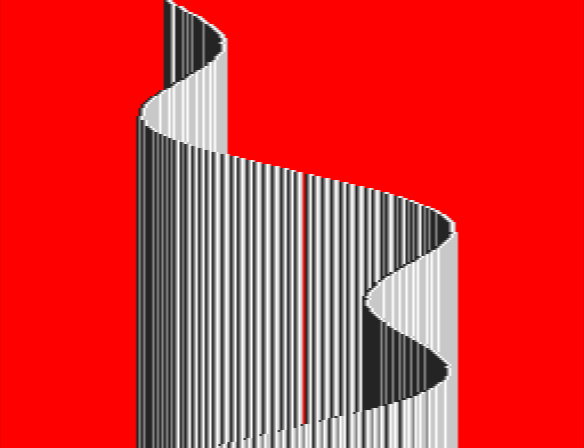

# snes-kefrens-bars

A man walks into some bars..

## screenshot

## description

This is a basic implementation of the classic "kefrens bars" effect (yes, I know [Alcatraz did it first](http://www.pouet.net/prod.php?which=14533)) inspired by the [super keftendo 256b intro](http://www.pouet.net/prod.php?which=70163) by [revenant](https://github.com/devinacker).

## implementation

This implementation works by displaying a single pixel row for the entire screen by modifying BG0's y-scroll reg during hblank. This pixel row is set up in mode7 (mostly for convenience) so that we get 8bit color, and each of the 256 pixels on the line corresponds to one of the 256 colors in CGRAM. By writing into CGRAM each scanline, we can "draw" additional bars as the raster scans the screen, thus achieving the effect.

It runs in 3.58mhz mode and spends a fair amount of frame time building one of the HDMA tables. It uses one HDMA channel to modify BG0's y-scroll, another channel to write to the CGRAM port address reg (this is the table that's rebuilt each frame), and 4 additional channels to write colors into CGRAM. It's totally unoptimized, but fairly minimal, so the code should be pretty understandable.

## videos

Most of the (short) development of the effect was livestreamed on [my twitch channel](https://www.twitch.tv/ferrisstreamsstuff). You can see the recordings on youtube here:

[Ferris Makes Demos - SNES Kefrens Bars](https://www.youtube.com/playlist?list=PL-sXmdrqqYYftC60qOJYsXelZGMwcSS4A)

## license

This code is licensed under the MIT license (see LICENSE).
